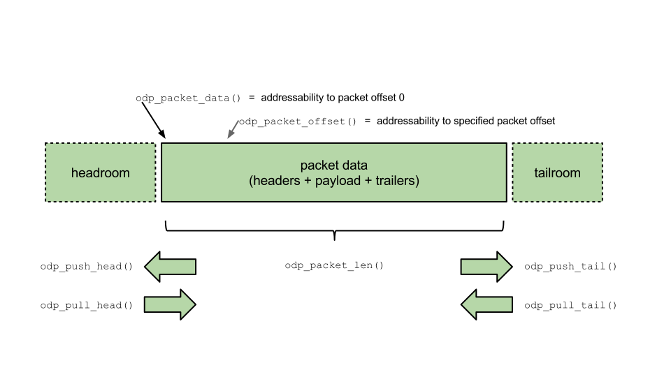
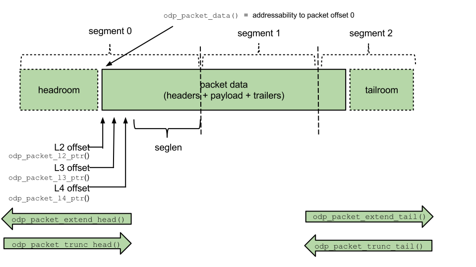

== Packet Processing
ODP applications are designed to process packets, which are the basic unit of
data of interest in the data plane. To assist in processing packets, ODP
provides a set of APIs that enable applications to examine and manipulate
packet data and metadata. Packets are referenced by an abstract *odp_packet_t*
handle defined by each implementation.

Packet objects are normally created at ingress when they arrive at a source
*odp_pktio_t* and are received by an application either directly or (more
typically) for a scheduled receive queue. They MAY be implicitly freed when
they are transmitted to an output *odp_pktio_t* via an associated transmit
queue, or freed directly via the `odp_packet_free()` API.

Occasionally an application may originate a packet itself, either _de novo_ or
by deriving it from an existing packet, and APIs are provided to assist in
these cases as well. Application-created packets can be recycled back through
a _loopback interface_ to reparse and reclassify them, or the application can
do its own parsing as desired.

Various attributes associated with a packet, such as parse results, are
stored as metadata and APIs are provided to permit applications to examine
and/or modify this information.

=== Packet Structure and Concepts
A _packet_ consists of a sequence of octets conforming to an architected
format, such as Ethernet, that can be received and transmitted via the ODP
*pktio* abstraction. Packets of a _length_, which is the number of bytes in
the packet. Packet data in ODP is referenced via _offsets_ since these reflect
the logical contents and structure of a packet independent of how particular
ODP implementations store that data.

These concepts are shown in the following diagram:

.ODP Packet Structure

Packet data consists of zero or more _headers_ followed by 0 or more bytes of
_payload_, followed by zero or more _trailers_.  Shown here are various APIs
that permit applications to examine and navigate various parts of a packet and
to manipulate its structure.

To support packet manipulation, predefined _headroom_ and _tailroom_
areas are logically associated with a packet. Packets can be adjusted by
_pulling_ and _pushing_ these areas. Typical packet processing might consist
of stripping headers from a packet via `odp_pull_head()` calls as part of
receive processing and then replacing them with new headers via
`odp_push_head()` calls as the packet is being prepared for transmit.

=== Packet Segments and Addressing
ODP platforms use various methods and techniques to store and process packets
efficiently. These vary considerably from platform to platform, so to ensure
portability across them ODP adopts certain conventions for referencing
packets.

ODP APIs use a handle of type *odp_packet_t* to refer to packet objects.
Associated with packets are various bits of system metadata that describe the
packet. By referring to the metadata, ODP applications accelerate packet
processing by minimizing the need to examine packet data. This is because the
metadata is populated by parsing and classification functions that are coupled
to ingress processing that occur prior to a packet being presented to the
application via the ODP scheduler.

When an ODP application needs to examine the contents of a packet, it requests
addressability to it via an API call that makes the packet (or a contiguously
addressable _segment_ of it) available for coherent access by the application.
To ensure portability, ODP applications assume that the underlying
implementation stores packets in _segments_ of implementation-defined
and managed size. These represent the contiguously addressable portions of a
packet that the application may refer to via normal memory accesses. ODP
provides APIs that allow applications to operate on packet segments in an
efficient and portable manner as needed. By combining these with the metadata
provided by packets, ODP applications can operate in a fully
platform-independent manner while still achieving optimal performance across
the range of platforms that support ODP.

The use of segments for packet addressing and their relationship to metadata
is shown in this diagram:

.ODP Packet Segmentation

The packet metadata is set during parsing and identifies the starting offsets
of the various headers in the packet. The packet itself is physically stored
as a sequence of segments that area managed by the ODP implementation.
Segment 0 is the first segment of the packet and is where the packet's headroom
and headers typically reside. Depending on the length of the packet,
additional segments may be part of the packet and contain the remaining packet
payload and tailroom. The application need not concern itself with segments
except that when the application requires addressability to a packet it
understands that addressability is provided on a per-segment basis. So, for
example, if the application makes a call like `odp_packet_l4_ptr()` to obtain
addressability to the packet's Layer 4 header, the returned length from that
call is the number of bytes from the start of the Layer 4 header that are
contiguously addressable to the application from the returned pointer address.
This is because the following byte occupies a different segment and may be
stored elsewhere. To obtain access to those bytes, the application simply
requests addressability to that offset and it will be able to address the
packet bytes that occupy the next segment, etc. Note that the returned
length for any packet addressability call is always the lesser of the remaining
packet length or size of its containing segment.  So a mapping for segment 2
in the above figure, for example, would return a length that extends only to
the end of the packet since the remaining bytes are part of the tailroom
reserved for the packet and are not usable by the application until made
available to it by an appropriate API call.

=== Metadata Processing
As noted, packet metadata is normally set by the parser as part of
classification that occurs during packet receive processing. It is important
to note that this metadata may be changed by the application to reflect
changes in the packet contents and/or structure as part of its processing of
the packet. While changing this metadata may effect some ODP APIs, changing
metadata is designed to _document_ application changes to the packet but
does not in itself _cause_ those changes to be made. For example, if an
application changes the Layer 3 offset by using the `odp_packet_l3_offset_set()`
API, the subsequent calls to `odp_packet_l3_ptr()` will return an address
starting from that changed offset, changing an attribute like
`odp_packet_has_udp_set()` will not, by itself, turn a non-UDP packet into
a valid UDP packet. Applications are expected to exercise appropriate care
when changing packet metadata to ensure that the resulting metadata changes
reflect the actual changed packet structure that the application has made.
