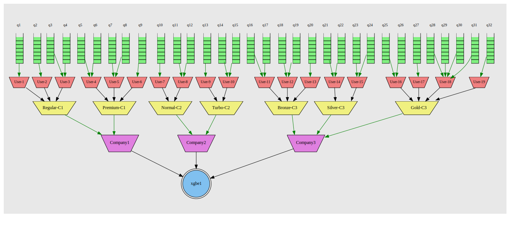
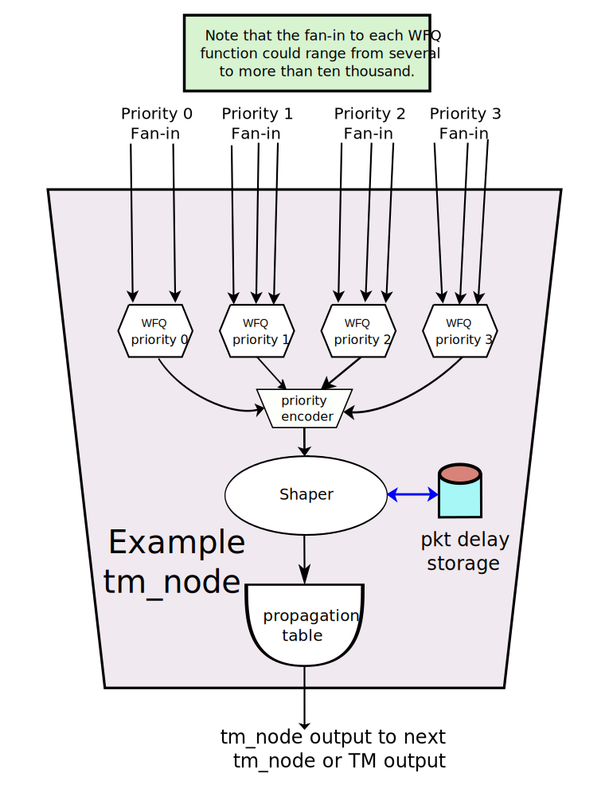

== Traffic Manager \(TM)

The TM subsystem is a general packet scheduling system that accepts
packets from input queues and applies strict priority scheduling, weighted fair
queueing scheduling and/or bandwidth controls to decide which input packet
should be chosen as the next output packet and when this output packet can be
sent onwards.

A given platform supporting this TM API could support one or more pure hardware
based packet scheduling systems, one or more pure software based systems or one
or more hybrid systems - where because of hardware constraints some of the
packet scheduling is done in hardware and some is done in software.  In
addition, there may also be additional API's beyond those described here for:

- controlling advanced capabilities supported by specific hardware, software
or hybrid subsystems
- dealing with constraints and limitations of
specific implementations.

The intention here is to be the simplest API that covers the vast majority of
packet scheduling requirements.

Often a TM subsystem's output(s) will be directly connected to a device's
physical (or virtual) output interfaces/links, in which case sometimes such a
system will be called an Egress Packet Scheduler or an Output Link Shaper,
etc..  While the TM subsystems configured by this API can be used in such a
way, this API equally well supports the ability to have the TM subsystem's
outputs connect to other TM subsystem input queues or general software queues
or even some combination of these three cases.

=== TM Algorithms

The packet scheduling/dropping techniques that can be applied to input
traffic include any mixture of the following:

- Strict Priority scheduling.
- Weighted Fair Queueing scheduling (WFQ).
- Bandwidth Shaping.
- Weighted Random Early Discard (WRED).

Note that Bandwidth Shaping is the only feature that can cause packets to be
"delayed", and Weighted Random Early Discard is the only feature (other than
input queues becoming full) that can cause packets to be dropped.

==== Strict Priority Scheduling

Strict Priority Scheduling (or just priority for short), is a technique where input
queues and the packets from them, are assigned a priority value in the range 0
.. ODP_TM_MAX_PRIORITIES - 1.  At all times packets with the smallest priority
value will be chosen ahead of packets with a numerically larger priority value.
This is called strict priority scheduling because the algorithm strictly
enforces the scheduling of higher priority packets over lower priority
packets.

==== Bandwidth Shaping

Bandwidth Shaping (or often just Shaping) is the term used here for the idea of
controlling packet rates using single rate and/or dual rate token bucket
algorithms.  For single rate shaping a rate (the commit rate) and a "burst
size" (the maximum commit count) are configured.  Then an internal signed
integer counter called the _commitCnt_ is maintained such that if the _commitCnt_
is positive then packets are eligible to be sent. When such a packet is
actually sent then its _commitCnt_ is decremented (usually by its length, but one
could decrement by 1 for each packet instead).  The _commitCnt_ is then
incremented periodically based upon the configured rate, so that this technique
causes the traffic to be limited to the commit rate over the long term, while
allowing some ability to exceed this rate for a very short time (based on the
burst size) in order to catch up if the traffic input temporarily drops below
the commit rate.

Dual Rate Shaping is designed to allow  certain traffic flows to fairly send
more than their assigned commit rate when the  scheduler has excess capacity.
The idea being that it may be better to allow some types of traffic to send
more than their committed bandwidth rather than letting the TM outputs be idle.
The configuration of Dual Rate Shaping requires additionally a peak rate and a
peak burst size.  The peak rate must be greater than the related commit
rate, but the burst sizes have no similar constraint.  Also for every input
priority that has Dual Rate shaping enabled, there needs to be an additional
equal or lower priority (equal or higher numeric priority value) assigned.
Then if the traffic exceeds its commit rate but not its peak rate, the
"excess" traffic will be sent at the lower priority level - which by the
strict priority algorithm should cause no degradation of the higher priority
traffic, while allowing for less idle outputs.

==== Weighted Fair Queuing

Weighted Fair Queuing (WFQ) is used to arbitrate amongst multiple input
packets with the same priority.  Each input can be assigned a weight in the
range MIN_WFQ_WEIGHT..MAX_WFQ_WEIGHT (nominally 1..255) that affects the way
the algorithm chooses the next packet.  If all of the weights are equal AND all
of the input packets are the same length then the algorithm is equivalent to a
round robin scheduling.  If all of the weights are equal but the packets have
different lengths then the WFQ algorithm will attempt to choose the packet such
that inputs each get a fair share of the bandwidth - in other words it
implements a weighted round robin algorithm where the weighting is based on
frame length.

When the input weights are not all equal and the input packet lengths vary then
the WFQ algorithm will schedule packets such that the packet with the lowest
"Virtual Finish Time" is chosen first.  An input packet's Virtual Finish Time
is roughly calculated based on the WFQ object's base Virtual Finish Time when
the packet becomes the first packet in its queue plus its frame length divided
by its weight.
----
virtualFinishTime = wfqVirtualTimeBase + (pktLength / wfqWeight)
----

In a system running at full capacity with no bandwidth limits - over the long
term - each input fan-in's average transmit rate will be the same fraction of
the output bandwidth as the fraction of its weight divided by the sum of all of
the WFQ fan-in weights.  Hence larger WFQ weights result in better "service"
for a given fan-in.

[source,c]
----
totalWfqWeight = 0;
for (each fan-in entity - fanIn - feeding this WFQ scheduler)
	totalWfqWeight += fanIn->sfqWeight;

fanIn->avgTransmitRate = avgOutputRatefanIn->sfqWeight / totalWfqWeight;
----

==== Weighted Random Early Discard

The Weighted Random Early Discard (WRED) algorithm deals with the situation
where an input packet rate exceeds some output rate (including the case where
Bandwidth Shaping limits some output rates).  Without WRED enabled and
configured, the TM system will just implement a tail dropping scheme whereby
whichever packet is unlucky enough to arrive when an TM input queue is full
will be discarded regardless of priority or any other consideration. WRED
allows one to configure the system to use a better/fairer algorithm than simple
tail dropping.  It works by measuring the "fullness" of various packet queues
and converting this percentage into a probability of random packet dropping
with the help of some configurable parameters. Then a random number is picked
and together with the drop probability, a decision is made to accept the packet
or drop it. A basic parameterization of WRED requires three parameters:

- the maximum queue level (which could be either a maximum number of
     packets or a maximum amount of memory (i.e. bytes/buffers) used),
- a starting threshold - which is a number in the range 0..100
     representing a percentage of the maximum queue level at which the
     drop probability becomes non-zero,
- a drop probability - which is a number in the range 0..100
     representing a probability (0 means no drop and 100 means
     certain drop) - which is used when the queue is near 100% full.

Note that all packet drops for a TM system only occur when a new packet arrives
at a given TM system input queue.  At that time either the WRED algorithm, if
enabled for this input queue, or the "input queue full" tail drop algorithm
will make a drop/no drop decision.  After this point, any packets not dropped,
will at some point be sent out a TM output - assuming that the topology is
fully connected and enabled.

=== Hierarchical Scheduling and tm_nodes

This API supports the ability to do Hierarchical Scheduling whereby the
final scheduling decision is controlled by equal priority schedulers,
strict priority multiplexers, bandwidth shapers - at multiple levels - all
forming a tree rooted at a single egress object.  In other words, all
tm_queues and tm_nodes have the property that their logical "output" feeds
into one fan-in of a subsequent tm_node or egresss object - forming a proper
tree.

.Hierarchical Scheduling

Multi-level/hierarchical scheduling adds both great control and significant
complexity.  Logically, despite the implication of the tm_node tree diagrams,
there are no queues between the levels of hierarchy.  Instead all packets are
held in their input queue, until such time that the totality of all of the
tm_nodes in the single path from input queue to output object agrees that this
packet should be the next to be chosen to leave the TM system through the
output object "portal".  Hence what flows from level to level is the "local
choice" of what packet/tm_queue should next be serviced.

==== tm_nodes

Tm_nodes are the main "entity"/object that a TM system is composed of. Each
tm_node is a mini-TM subsystem of its own, but the interconnection and
interplay of a multi-level "tree" of tm_nodes can allow the user to specify
some very sophisticated behaviours. Each tm_node can contain a set of scheduler
(one per strict priority level), a strict priority multiplexer, a bandwidth
shaper and a WRED component - or a subset of these.

.Traffic Manager Node

In its full generality an tm_node consists of a set of "fan-in" connections to
preceding tm_queues or tm_nodes.  The fan-in for a single tm_node can range
from 1 to many many thousands.  This fan-in is divided first into a WFQ
scheduler per priority level. So if 4 priority levels are implemented by this
tm_node, there would be 4 WFQ schedulers - each with its own unique fan-in.
After the WFQ schedulers a priority chooser comes next - where it will always
choose the highest priority WFQ output available.  The output of the priority
chooser then feeds a bandwidth shaper function which then finally uses the
shaper's propagation table to determine its output packet and its priority.
This output could then be remapped via a priority map profile and then becomes
one of the input fan-in to perhaps another level of tm_nodes, and so on.

During this process it is important to remember that the bandwidth shaping
function never causes packets to be dropped.  Instead all packet drops occur
because of tm_queue fullness or be running the WRED algorithm at the time a new
packet attempts to be appended to the end of some input queue.

The WRED profile associated with an tm_node considers the entire set of
tm_queues feeding directly or indirectly into it as its measure of queue
fullness.

==== tm_queues

tm_queues are the second major type of "entity"/object that a TM system is
composed of.  All packets MUST first enter the TM system via some tm_queue.
Then logically, the head packets of all of the tm_queues are examined
simultaneously by the entire TM system, and ONE tm_queue is chosen send its
head packet out of the TM system's egress.  Abstractly packets stay in the
tm_queue until they are chosen at which time they are instantly transferred
from tm_queue to/through the corresponding TM egress. It is also important to
note that packets in the same tm_queue MUST always stay in order.  In other
words, the second packet in an tm_queue must never leave the TM system through
a TM egress spigot before the first packet has left the system.  So tm_queue
packet order must always be maintained.

==== TM egress

Note that TM egress objects are NOT referred to as queues, because in many/most
cases they don't have multi-packet structure but instead are viewed as a
port/spigot through which the TM system schedules and finally transfers input
packets through.

=== Ideal versus Actual Behavior

It is important to recognize the difference between the "abstract" mathematical
model of the prescribed behavior and real implementations. The model describes
the Ideal, but theoretically desired behavior, but such an Ideal is generally
not practical to implement.  Instead, one understands that virtually all Real
TM systems attempt to approximate the Ideal behavior as given by the TM
configuration as best as they can - while still attaining high packet
processing performance.  The idea is that instead of trying too hard to be
"perfect" at the granularity of say microseconds, it may be better to instead
try to match the long term Ideal behavior over a much more reasonable period of
time like a millisecond.  It is generally better to have a stable
implementation that when averaged over a period of several milliseconds matches
the Ideal behavior very closely than to have an implementation that is perhaps
more accurate over a period of microseconds, but whose millisecond averaged
behavior drifts away from the Ideal case.

=== Other TM Concepts

==== Profiles

This specification often packages related TM system parameters into
records/objects called profiles.  These profiles can then be associated with
various entities like tm_nodes and tm_queue's.  This way the amount of storage
associated with setting related parameters can be reduced and in addition it is
common to re-use the same set of parameter set over and over again, and also to
be able to change the parameter set once and have it affect lots of entities
with which it is associated with/applied to.

==== Absolute Limits versus  `odp_tm_capability_t`

This header file defines some constants representing the absolute maximum
settings for any TM system, though in most cases a TM system can (and should)
be created/instantiated with smaller values, since lower values will often
result in faster operation and/or less memory used.

=== Examples

.Create a tm_node chain for two nodes and associate the scheduler
[source,c]
----

   odp_tm_params_init(&tm_params); // <1>
   tm_params.pktio = egress_pktio;
   tm = odp_tm_create("Example TM", &tm_params);

/* create 5 input queues here - two at priority 1 and three at priority 2. */

   odp_tm_queue_params_init(&queue_params);
   queue_params.priority = 1;
   tmq_A1 = odp_tm_queue_create(tm, &queue_params);
   tmq_B1 = odp_tm_queue_create(tm, &queue_params);

   queue_params.priority = 2;
   tmq_A2 = odp_tm_queue_create(tm, &queue_params);
   tmq_B2 = odp_tm_queue_create(tm, &queue_params);
   tmq_C2 = odp_tm_queue_create(tm, &queue_params);

   odp_tm_node_params_init(&node_params); // <2>
   node_params.level = 1;
   tm_node_1 = odp_tm_node_create(tm, "TmNode1", &node_params);

   odp_tm_queue_connect(tmq_A1, tm_node_1); // <3>
   odp_tm_queue_connect(tmq_B1, tm_node_1);
   odp_tm_queue_connect(tmq_A2, tm_node_1);
   odp_tm_queue_connect(tmq_B2, tm_node_1);
   odp_tm_queue_connect(tmq_C2, tm_node_1);

/* It is IMPORTANT to understand that the following code does NOT create any
schedulers!  In fact there is NO call to create a tm scheduler that exists
inside of a tm_node.  Such an entity comes into existence as needed. What this
code does is create a scheduler PROFILE, which is effectively a registered set
of common scheduler parameters.  NOTE that this uses some pseudocode below
instead of real C code so as to be more concise. */

   odp_tm_sched_params_init(&sched_params); // <4>
   sched_params.sched_modes = { ODP_TM_FRAME_BASED_WEIGHTS, ... };
   sched_params.sched_weights = { 8, 8, 8,  ... };
   sched_profile_RR = odp_tm_sched_create("SchedProfileRR", &sched_params);

   sched_params.sched_modes = { ODP_TM_BYTE_BASED_WEIGHTS, ... };
   sched_params.sched_weights = { 8, 8, 8, ... };
   sched_profile_FQ = odp_tm_sched_create("SchedProfileFQ", &sched_params);

   odp_tm_queue_sched_config(tm_node_1, tmq_A1, sched_profile_RR); // <5>
   odp_tm_queue_sched_config(tm_node_1, tmq_B1, sched_profile_RR);
   odp_tm_queue_sched_config(tm_node_1, tmq_A2, sched_profile_FQ);
   odp_tm_queue_sched_config(tm_node_1, tmq_B2, sched_profile_FQ);
   odp_tm_queue_sched_config(tm_node_1, tmq_C2, sched_profile_FQ);

   odp_tm_node_params_init(&node_params); // <6>
   node_params.level = 2;
   tm_node_2 = odp_tm_node_create(tm, "TmNode2", &node_params);

   odp_tm_node_connect(tm_node_1, tm_node_2); // <7>

   odp_tm_sched_params_init(&sched_params); // <8>
   sched_params.sched_modes = { ODP_TM_BYTE_BASED_WEIGHTS, ... };
   sched_params.sched_weights = { 8, 16, 24,  ... };
   sched_profile_WFQ = odp_tm_sched_create("SchedProfileWFQ", &sched_params);

   odp_tm_node_sched_config(tm_node_2, tm_node_1, sched_profile_WFQ); // <9>
----

<1> Create a tm system, since that is a precursor to creating tm_queues.
<2> Create a Node #1
<3> Connect the Queue(s) to the Node -> odp_tm_queue_connect()
<4> Create two sets of scheduler params - one implementing Round Robin (since
all weights are the same - namely 8) and the second implementing Fair Queuing.

<5> Associate the Scheduler to the Node and the Queue(s) -> odp_tm_queue_sched_config()
Use the Round Robin profile for the priority 1 fan-ins and Fair Queuing
for the priority 2 fan-ins.

<6> Create a second Node #2
<7> Connect the first Node #1 to the second Node #2 -> odp_tm_node_connect()
<8> Create a Scheduler Profile
<9> Associate the Scheduler to the Node #1 and #2 -> odp_tm_node_sched_config()
