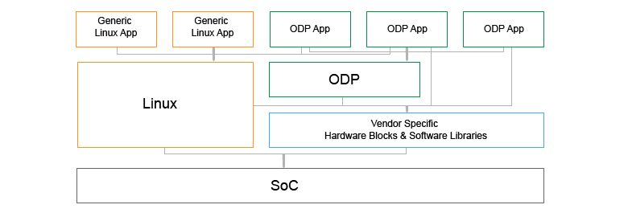

OpenDataPlane (ODP)  Users-Guide
================================
:toc:

:numbered!:
[abstract]
Abstract
--------
This document is intended to guide a new ODP application developer.
Further details about ODP may be found at the http://opendataplane.org[ODP] home page.

.Overview of a system running ODP applications

ODP is an API specification that allows many implementations to provide platform independence, automatic hardware acceleration and CPU scaling to high performance networking  applications.
This document describes how to write an application that can successfully take advantage of the API.

:numbered:
== Introduction ==
.OpenDataPlane Components
image::../images/odp_components.png[align="center"]

.The ODP API Specification
ODP consists of three separate but related component parts. First, ODP is an
abstract API specification that describes a functional model for
data plane applications. This specification covers many common data plane
application programming needs, such as the ability to receive, manipulate, and
transmit packet data, without specifying how these functions are performed. This
is quite intentional. It is precisely because ODP APIs do not have a preferred
embodiment that they permit innovation in how these functions can
be realized on various platforms that offer implementations of ODP. To achieve
this goal, ODP APIs are described using abstract data types whose definition
is left up to the ODP implementer.  For example, in ODP packets are referenced
by abstract handles of type +odp_packet_t+, and packet-related APIs take
arguments of this type. What an +odp_packet_t+ actually is is not part of the
ODP API specification--that is the responsibility of each ODP implementation.

.Summary: ODP API attributes:
* Open Source, open contribution, BSD-3 licensed.
* Vendor and platform neutral.
* Application-centric.  Covers functional needs of data plane applications.
* Ensures portability by specifying the functional behavior of ODP.
* Defined jointly and openly by application writers and platform implementers.
* Archiected to be implementable on a wide range of platforms efficiently
* Sponsored, governed, and maintained by the Linaro Networking Group (LNG)

.ODP Implementations
Second, ODP consists of multiple implementations of this API specification,
each tailored to a specific target platform. ODP implementations determine
how each ODP abstract type is represented on that platform and how each ODP
API is realized. On some platforms, ODP APIs will
be realized using specialized instructions that accelerate the functional
behavior specified by the API. On others, hardware co-processing engines may
completely offload the API so that again it can be performed with little or no
involvement by a CPU. In all cases, the application sees the same
functional behavior independent of how a given platform has chosen to realize
it. By allowing each platform the freedom to determine how best to realize each
API's specified functional behavior in an optimal manner, ODP permits
applications written to its APIs to take full advantage of the unique
capabilities of each platform without the application programmer needing to
have specialist knowledge of that platform or to be concerned with how best
to tune the application to a particular platform. This latter consideration is
particularly important in Network Function Virtualization (NFV) environments
where the application will run on a target platform chosen by someone else.

.Summary: ODP Implementation Characteristics
* One size does not fit all--supporting multiple implementations allows ODP
to adapt to widely differing internals among platforms.
* Anyone can create an ODP implementation tailored to their platform
* Distribution and mainteinance of each implementation is as owner wishes
  - Open source or closed source as business needs determine
  - Have independent release cycles and service streams
* Allows HW and SW innovation in how ODP APIs are implemented on each platform.

.Reference Implementations
To make it easy to get started with implementing ODP on a new platform, ODP
supplies a number of _reference implementations_ that can serve as a
starting point.  The two primary references implementations supplied by ODP are
*odp-linux* and *odp-dpdk*

.odp-linux
The *odp-linux* reference implementation is a pure SW implementation of the
ODP API that relies only on the Linux programming API. As a functional model
for ODP, it enables ODP to be bootstrapped easily to any platform that
supports a Linux kernel.

.odp-dpdk
The *odp-dpdk* reference implementation is a pure SW implementation of the
ODP API that uses http://dpdk.org[DPDK] as a SW accelerator. In particular,
*odp-dpdk* offers superior I/O performance for systems that use NICs, allowing
ODP applications to take immediate full advantage of the various NIC device
drivers supported by DPDK.

.Summary: ODP Reference Implementations
* Open source, open contribution, BSD-3 licensed.
* Provide easy bootstrapping of ODP onto new platforms
* Implementers free to borrow or tailor code as needed for their platform
* Implementers retain full control over their implementations whether or not
they are derived from a reference implementation.

.ODP Validation Test Suite
Third, to enure consistency between different ODP implementations, ODP
consists of a validation suite that verifies that any given implementation of
ODP faithfully provides the specified functional behavior of each ODP API.
As a separate open source component, the validation suite may be used by
application writers, system integrators, and platform providers alike to
confirm that any purported implementation of ODP does indeed conform to the
ODP API specification.

.Summary: ODP Validation Test Suite
* Synchronized with ODP API specification
* Maintained and distributed by LNG
* Open source, open contribution, BSD-3 licensed.
* Key to ensuring application portability across all ODP implementations
* Tests that ODP implementations conform to the specified functional behavior
of ODP APIs.
* Can be run at any time by users and vendors to validat implementations
od ODP.

=== ODP API Specification Versioning ===
As an evolving standard, the ODP API specification is released under an
incrementing version number, and corresponding implementations of ODP, as well
as the validation suite that verifies API conformance, are linked to this
version number. ODP versions are specified using a stanard three-level
number (major.minor.fixlevel) that are incremented according to the degree of
change the level represents. Increments to the fixlevel represent clarification
of the specification or other minor changes that do not affect either the
syntax or semantics of the specification. Such changes in the API specification
are expected to be rare. Increments to the minor level
represent the introduction of new APIs or functional capabilities, or changes
to he specified syntax or functional behavior of APIs and thus may require
application source code changes. Such changes are well documented in the
release notes for each revision of the specification. Finally, increments to
the major level represent significant structural changes that most likely
require some level of application source code change, again as documented in
the release notes for that version.

=== ODP Implementation Versioning ===
ODP implementations are free to use whatever release naming/numbering
conventions they wish, as long as it is clear what level of the ODP API a given
release implements. A recommended convention is to use the same three level
numbering scheme where the major and minor numbers correspond to the ODP API
level and the fixlevel represents an implementation-defined service level
associated with that API level implementation. The LNG-supplied ODP reference
implementations follow this convention.

=== ODP Validation Test Suite Versioning ===
The ODP validation test suite follows these same naming conventions. The major
and minor release numbers correspond to the ODP API level that the suite
validates and the fixlevel represents the service level of the validation
suite itself for that API level.

=== ODP Design Goals ===
ODP has three primary goals that follow from its component structure. The first
is application portability across a wide range of platforms. These platforms
differ in terms of processor instruction set architecture, number and types of
application processing cores, memory oranization, as well as the number and
type of platform specific hardware acceleration and offload features that
are available. ODP applications can move from one conforming implementation
to another with at most a recompile.

Second, ODP is designed to permit data plane applications to avail themselves
of platform-specific features, including specialized hardware accelerators,
without specialized programming. This is achieved by separating the API
specification from their implementation on individual platforms. Since each
platform implements each ODP API in a manner optimal to that platform,
applications automatically gain the benefit of such optimizations without the
need for explicit programming.

Third, ODP is designed to allow applications to scale out automatically to
support many core architectures. This is done using an event based programming
model that permits applications to be written to be independent of the number
of processing cores that are available to realize application function. The
result is that an application written to this model does not require redesign
as it scales from 4, to 40, to 400 cores.

== Organization of this Document ==
This document is organized into several sections. The first presents a high
level overview of the ODP API component areas and their associated abstract
data types. This section introduces ODP APIs at a conceptual level.
The second provides a tutorial on the programming model(s)
supported by ODP, paying particular attention to the event model as this
represents the preferred structure for most ODP applications. This section
builds on the concepts introduced in the first section and shows how ODP
applications are structured to best realize the three ODP design goals
mentioned earlier. The third section provides a more detailed overview of
the major ODP API components and is designed to serve as a companion to the
full reference specification for each API. The latter is intended to be used
by ODP application programmers, as well as implementers, to understand the
precise syntax and semantics of each API.

== ODP API Concepts ==
ODP programs are built around several conceptual structures that every
appliation programmer needs to be familiar with to use ODP effectively. The
main ODP concepts are:
Thread, Event, Queue, Pool, Shared Memory, Buffer, Packet, PktIO, Timer,
and Synchronizer.

=== Thread ===
The thread is the fundamental programming unit in ODP.  ODP applications are
organized into a collection of threads that perform the work that the
application is designed to do. ODP threads may or may not share memory with
other threads--that is up to the implementation. Threads come in two "flavors":
control and worker, that are represented by the abstract type
+odp_thread_type_t+.

A control thread is a supervisory thread that organizes
the operation of worker threads. Worker threads, by contrast, exist to
perform the main processing logic of the application and employ a run to
completion model. Worker threads, in particular, are intended to operate on
dedicated processing cores, especially in many core proessing environments,
however a given implementation may multitask multiple threads on a single
core if desired (typically on smaller and lower performance target
environments).

In addition to thread types, threads have associated _attributes_ such as
_thread mask_ and _scheduler group_ that determine where they can run and
the type of work that they can handle. These will be discussed in greater
detail later.

=== Event ===
Events are what threads process to perform their work. Events can represent
new work, such as the arrival of a packet that needs to be processed, or they
can represent the completion of requests that have executed asynchronously.
Events can also represent notifications of the passage of time, or of status
changes in various components of interest to the application. Events have an
event type that describes what it represents. Threads can create new events
or consume events processed by them, or they can perform some processing on
an event and then pass it along to another component for further processing.
References to events are via handles of abstract type +odp_event_t+. Cast
functions are provided to convert these into specific handles of the
appropriate type represented by the event.

=== Queue ===
A queue is a message passing channel that holds events.  Events can be
added to a queue via enqueue operations or removed from a queue via dequeue
operations. The endpoints of a queue will vary depending on how it is used.
Queues come in two major types: polled and scheduled, which will be
discussed in more detail when the event model is introduced. Queues may also
have an associated context, which represents a persistent state for all
events that make use of it. These states are what permit threads to perform
stateful processing on events as well as stateless processing.

Queues are represented by handles of abstract type +odp_queue_t+.

=== Pool ===
A pool is a shared memory area from which elements may be drawn. Pools
represent the backing store for events, among other things. Pools are
typically created and destroyed by the application during initialization and
termination, respectively, and then used during processing. Pools may be
used by ODP components exclusively, by applications exclusively, or their
use may be shared between the two. Pools have an associated type that
characterizes the elements that they contain. The two most important pool types
are Buffer and Packet.

Pools are represented by handles of abstract type +odp_pool_t+.

=== Shared Memory ===
Shared memory represents raw blocks of storage that are sharable between
threads. They are the building blocks of pools but can be used directly by
ODP applications if desired.

Shared memory is represented by handles of abstract type +odp_shm_t+.

=== Buffer ===
A buffer is a fixed sized block of shared storage that is used by ODP
components and/or applications to realize their function. Buffers contain
zero or more bytes of application data as well as system maintained
metadata that provide information about the buffer, such as its size or the
pool it was allocated from. Metadata is an important ODP concept because it
allows for arbitrary amounts of side information to be associated with an
ODP object. Most ODP objects have assocaited metadata and this metadata is
manipulated via accessor functions that act as getters and setters for
this information. Getter acces functions permit an application to read
a metadata item, while setter access functions permit an application to write
a metadata item. Note that some metadata is inherently read only and thus
no setter is provided to manipulate it.  When object have multiple metadata
items, each has its own associated getter and/or setter access function to
inspect or manipulate it.

Buffers are represened by handles of abstract type +odp_buffer_t+.

=== Packet ===
Packets are received and transmitted via I/O interfaces and represent
the basic data that data plane applications manipulate.
Packets are drawn from pools of type +ODP_POOL_PACKET+.
Unlike  buffers, which are simple objects,
ODP packets have a rich set of semantics that permit their inspection
and manipulation in complex ways to be described later. Packets also support
a rich set of metadata as well as user metadata. User metadata permits
applications to associate an application-determined amount of side information
with each packet for its own use.

Packets are represented by handles of abstract type +odp_packet_t+.

=== PktIO ===
PktIO is how ODP represents I/O interfaces. A pktio object is a logical
port capable of receiving and/or transmitting packets. This may be directly
supported by the underlying platform as an integrated feature,
or may represent a device attached via a PCIE or other bus.

PktIOs are represented by handles of abstract type +odp_pktio_t+.

=== Timer ===
Timers are how ODP applications measure and respond to the passage of time.
Timers are drawn from specialized pools called timer pools that have their
own abstract type (+odp_timer_pool_t+). Applications may have many timers
active at the same time and can set them to use either relative or absolute
time. When timers expire they create events of type +odp_timeout_t+, which
serve as notifications of timer expiration.

=== Synchronizer ===
Multiple threads operating in parallel typically require various
synchronization services to permit them to operate in a reliable and
coordinated manner. ODP provides a rich set of locks, barriers, and similar
synchronization primitives, as well as abstract types for representing various
types of atomic variables. The ODP event model also makes use of queues to
avoid the need for explicit locking in many cases. This will be discussed
in the next section.

== ODP Components ==
Building on ODP concepts, ODP offers several components that relate to the
flow of work through an ODP application. These include the Classifier,
Scheduler, and Traffic Manager.  These components relate to the three
main stages of packet processing: Receive, Process, and Transmit.

=== Classifier ===
The *Classifier* provides a suite of APIs that control packet receive (RX)
processing.

.ODP Receive Processing with Classifier
image::../images/odp_rx_processing.png[align="center"]

The classifier provides two logically related services:
[horizontal]
Packet parsing:: Verifying and extracting structural information from a
received packet.

Packet classification:: Applying *Pattern Matching Rules (PMRs)* to the
parsed results to assign an incoming packet to a *Class of Service (CoS)*.

Combined, these permit incoming packets to be sorted into *flows*, which are
logically related sequences of packets that share common processing
requirements. While many data plane applications perform stateless packet
processing (_e.g.,_ for simple forwarding) others perform stateful packet
processing.  Flows anchor state information relating to these groups of
packets.

A CoS determines two variables for packets belonging to a flow:
[list]
* The pool that they will be stored in on receipt
* The queue that they will be added to for processing

The PMRs supported by ODP permit flow determination based on combinations of
packet field values (tuples). The main advantage of classification is that on
many platforms these functions are performed in hardware, meaning that
classification occurs at line rate as packets are being received without
any explicit processing by the ODP application.

Note that the use of the classifier is optional.  Applications may directly
receive packets from a corresponding PktIO input queue via direct polling
if they choose.

=== Scheduler ===
The *Scheduler* provides a suite of APIs that control scalabable event
processing.

.ODP Scheduler and Event Processing
image::../images/odp_scheduling.png[align="center"]

The Scheduler is responsible for selecting and dispatching one or more events
to a requesting thread. Event selection is based on several factors involving
both the queues containing schedulable events and the thread making an
+odp_schedule()+ or +odp_schedule_multi()+ call.

ODP queues have a _scheduling priority_ that determines how urgently events
on them should be processed relative to events contained in other queues.
Queues also have a _scheduler group id_ associated with them that must match
the associated scheduler group _thread mask_ of the thread calling the
scheduler. This permits events to be grouped for processing into classes and
have threads that are dedicated to processing events from specified classes.
Threads can join and leave scheduler groups dynamically, permitting easy
application response to increases in demand.

When a thread receives an event from the scheduler, it in turn can invoke
other processing engines via ODP APIs (_e.g.,_ crypto processing) that
can operate asynchronously. When such processing is complete, the result is
that a *completion event* is added to a schedulable queue where it can be
scheduled back to a thread to continue processing with the results of the
requested asynchronous operation.

Threads themselves can enqueue events to queues for downstream processing
by other threads, permitting flexibility in how applicaitions structure
themselves to maximize concurrency.

=== Traffic Manager ===
The *Traffic Manager* provides a suite of APIs that control traffic shaping and
Quality of Service (QoS) processing for packet output.

.ODP Transmit processing with Traffic Manager
image::../images/odp_traffic_manager.png[align="center"]

The final stage of packet processing is to transmit it. Here, applications have
several choices.  As with RX processing, applications may send packets
directly to PktIO TX queues for direct transmission.  Often, however,
applications need to perform traffic shaping and related
*Quality of Service (QoS)* processing on the packets comprising a flow as part
of transmit processing. To handle this need, ODP provides a suite of
*Traffic Manager* APIs that permit programmatic establishment of arbiters,
shapers, etc. that control output packet processing to achieve desired QoS
goals. Again, the advantage here is that on many platforms traffic management
functions are implemented in hardware, permitting transparent offload of
this work.

Glossary
--------
[glossary]
odp_worker::
    An opd_worker is a type of odp_thread. It will usually be isolated from the scheduling of any host operating system and is intended for fast-path processing with a low and predictable latency. Odp_workers will not generally receive interrupts and will run to completion.
odp_control::
    An odp_control is a type of odp_thread. It will be isolated from the host operating system house keeping tasks but will be scheduled by it and may receive interrupts.
odp_thread::
    An odp_thread is a flow of execution that in a Linux environment could be a Linux process or thread.
event::
    An event is a notification that can be placed in a queue.

The include structure
---------------------
Applications only include the 'include/odp.h file which includes the 'platform/<implementation name>/include/plat' files to provide a complete definition of the API on that platform.
The doxygen documentation defining the behavior of the ODP API is all contained in the public API files, and the actual definitions for an implementation will be found in the per platform directories.
Per-platform data that might normally be a #define can be recovered via the appropriate access function if the #define is not directly visible to the application.

.Users include structure
----
./
├── include/
│   ├── odp/
│   │   └── api/
│   │       └── The Public API and the documentation.
│   │
│   └── odp.h   This file should be the only file included by the application.
----

Initialization
--------------
IMPORTANT: ODP depends on the application to perform a graceful shutdown, calling the terminate functions should only be done when the application is sure it has closed the ingress and subsequently drained all queues etc.

Startup
~~~~~~~~
The first API that must be called is 'odp_init_global()'.
This takes two pointers, odp_init_t contains ODP initialization data that is platform independent and portable.
The second odp_platform_init_t is passed un parsed to the  implementation and can be used for platform specific data that is not yet, or may never be suitable for the ODP API.

The second API that must be called is 'odp_init_local()', this must be called once per odp_thread, regardless of odp_thread type.  Odp_threads may be of type ODP_THREAD_WORKER or ODP_THREAD_CONTROL

Shutdown
~~~~~~~~~
Shutdown is the logical reverse of the initialization procedure, with 'odp_thread_term()' called for each worker before 'odp_term_global()' is called.

image::../images/resource_management.png[align="center"]

Queues
------
There are three queue types, atomic, ordered and parallel.
A queue belongs to a single odp_worker and a odp_worker may have multiple queues.

Events are sent to a queue, and the the sender chooses a queue based on the service it needs.
The sender does not need to know which odp_worker (on which core) or HW accelerator will process the event, but all the events on a queue are eventually scheduled and processed.

NOTE: Both ordered and parallel queue types improve throughput over an atomic queue (due to parallel event processing), but the user has to take care of the context data synchronization (if needed).

Atomic Queue
~~~~~~~~~~~~
Only one event at a time may be processed from a given queue. The processing maintains order and context data synchronization but this will impair scaling.

.Overview Atomic Queue processing
image::../images/atomic_queue.png[align="center"]

Ordered Queue
~~~~~~~~~~~~~
An ordered queue will ensure that the sequencing at the output is identical to that of the input, but multiple events may be processed simultaneously and the order is restored before the events move to the next queue

.Overview Ordered Queue processing
image::../images/ordered_queue.png[align="center"]

Parallel Queue
~~~~~~~~~~~~~~
There are no restrictions on the number of events being processed.

.Overview parallel Queue processing
image::../images/parallel_queue.png[align="center"]
